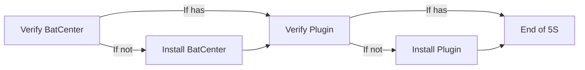

# FiveStep(5S)

FiveStep as the name suggests has five steps.



Simple usage: 
```cmd
call 5s gecho
```


--- 
> For Silent Install
```cmd 
call 5s gecho >nul 2>nul
```


``` 5S inside of 7z zip in install folder. ```
```diff
────BatCenter
    │   5S.md
    │   Bat.bat
    │   Change.log
    │   LICENSE
    │   README.md
    │   USAGE.md
    │
    ├───Files
    │       7za.exe
    │       EnvUpdate.bat
    │       GetDim.Bat
    │       Getlen.bat
    │       jq.exe
    │       Progress.bat
    │       ReadLine.exe
    │       StrSplit.exe
    │       StrSurr.exe
    │       Transfer.bat
    │       wget.exe
    │
    └───Install
+           bat.7z
            batcenter_install.bat
            hosts.txt      
```
Or you can call it with `bat move 5s`
 - Will create a copy to your directory.

### You need to put 5S to your file's folder, Because if a user do not have BatCenter, 5S will install BatCenter

#### It is included by default in newer versions of BatCenter.

##### ~Groophy Lifefor